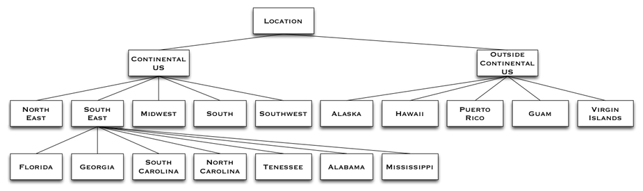
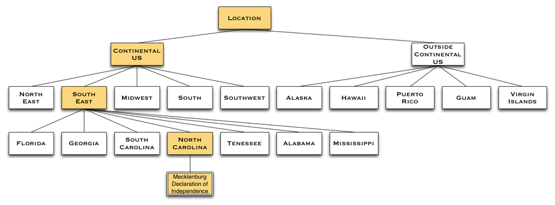

:tocdepth: 2

**********
Taxonomies
**********

A `taxonomy <http://www.wordnik.com/words/taxonomy>`_ is a hierarchical classification of items
in a collection. A taxonomy is made up of a tree of categories from the more general at the root
of the taxonomy to the more specific at the leaves of the taxonomy. Here is a simple abbreviated example
of a taxonomy of US locations:

In the example the taxonomy is called "Location" and it consists of categories such as "Continental US" and
"Florida".

An item classified in a category in a taxonomy is a member of that category and all of that category's
parents. As an illustrative example, imagine an item, “Mecklenburg Declaration of Independence”, classified with the category "North Carolina". It's also a member of
"South East", "Continental US" and the "Location" taxonomy as a whole.

With Falkland CMS, it is typical to have multiple orthogonal taxonomies categorizing the items in a collection. 

In addition to being classified in multiple different taxonomies, items can also be categorized in more than 1 category in
the same taxonomy. In fact, as has been pointed out above, it is rare for items to be categorized in just one
category in a taxonomy since they are members of their categories' parent categories as well.

Categories have a slug and a path. The category slug must follow all the `standard rules <./index.html#slugs>`_ for slugs in Falkland-CMS and
must be unique to all other categories *at the same level and location in the same taxonomy*. The path to a category is
made up of the collection, the taxonomy slug, all the parent slugs and finally the category slug. In our sample taxonomy
for example, the slug for the "North Carolina" category is "north-carolina" and the path is:

	/founding-documents/location/continental-us/south-east/north-carolina/

Listing items at the path above means the "Mecklenburg Declaration of Independence" will be listed since it is classified
in the "North Carolina" category, and listing the items in the following paths would also include the "Mecklenburg Declaration of Independence":

- /founding-documents/location/continental-us/south-east/
- /founding-documents/location/continental-us/
- /founding-documents/location/
- /founding-documents/

Some examples of taxonomies:

- type of media
- type of document
- geographic location
- topic
- time period
- biological classification
- chemical classification
- Dewey Decimal Classification
- folk taxonomies

There is an extensive `list of taxonomies <http://www.taxonomywarehouse.com/headword_list_new.aspx?vObject=10076&stype=ab>`_ at the Taxonomy Warehouse.

The categories in a taxonomy are represented as name/value pairs with the name being the category slug and the value being the category name. The structure
of the taxonomy is represented as name/value pairs with the name being the word "categories" and the value being an array of categories.

Here is a fragmentary example of the JSON representation of the sample taxonomy depicted above:

.. code-block:: json

	{
	  "name":"Location",
	  "slug":"location",
	  "collection":"founding-documents",
	  "description":"US Location",
	  "categories": [
	  	{"continental-us": "Continental US", "categories": [
	  		{"north-east": "North East"},
	  		{"south-east": "South East", "categories": [
	  			{"florida": "Florida"},
	  			{"georgia": "Georgia"},
	  			{"north-carolina": "North Carolina"},
	  			{"south-carolina": "South Carolina"},
	  			{"tennessee": "Tennessee"},
	  			{"alabama": "Alabama"}
	  		]},
	  		{"midwest": "Midwest"},
	  		{"south": "South"},
	  		{"southwest": "Southwest"},
	  		{"west": "West"}]},
	  	{"non-continental-us": "Outiside Continental US"}
	  ]
	}

Here is complete example of the entire JSON representation of a taxonomy:

.. code-block:: json

	{
	  "name":"Topics",
	  "created_at":"2013-06-23T05:30:50Z",
	  "updated_at":"2013-06-23T05:30:50Z",
	  "slug":"topics",
	  "collection":"falkland-islands",
	  "description":"",
	  "categories": [
			{"natural-history" : "Natural History", "categories": [
	  		{"flora": "Flora"},
				{"insects": "Insects"},
				{"fishes": "Fishes"},
				{"birds": "Birds", "categories": [
					{"penguins": "Penguins"}
				]},
				{"mammals": "Mammals"}]},
			{"pre-20th-century-history": "Pre-20th Century History", "categories": [
	  		{"naval": "Naval"},
				{"legal-political": "Legal / Political"},
				{"darwin": "Charles Darwin"}
			]},
			{"modern-history": "Modern History", "categories": [
	 			{"naval": "Naval"},
	 			{"legal-political": "Legal / Political"}
	 		]},
			{"military-history": "Military History", "categories": [
	 			{"ww1": "World War I"},
	 			{"ww2": "WW II History"},
	 			{"1982": "1982 Falklands War", "categories": [
	 				{"political": "Political", "categories": [
	 					{"thatcher": "Margaret Thatcher"}
	 				]},
	 				{"naval": "Naval", "categories": [
	 					{"uk": "UK", "categories": [
	 						{"sheffield": "HMS Sheffield"},
	 						{"invincible": "HMS Invincible"},
	 						{"hermes": "HMS Hermes"},
	 						{"conqueror": "HMS Conqueror"},
	 						{"canberra": "SS Canberra"},
	 						{"qe2": "HMS Queen Elizabeth 2"},
	 						{"galahad-tristram": "RFA Sir Galahad & RFA Sir Tristram"}
	 					]},
	 					{"argentina": "Argentina", "categories": [
	 						{"belgrano": "ARA General Belgrano"}
	 					]}
	 				]},
	 				{"air": "Air", "categories": [
	 					{"uk": "UK", "categories": [
	 						{"harrier": "Harrier"},
	 						{"Vulcan": "Vulcan"}
	 					]},
	 					{"argentina": "Argentina"}]},
	 				{"ground": "Ground", "categories": [
	 					{"uk": "UK", "categories": [
	 						{"3-commando": "3 Commando Brigade", "categories": [
	   						{"sas": "SAS"},
	 							{"40-commando": "40 Commando, Royal Marines"},
	 							{"42-commando": "42 Commando, Royal Marines"},
	 							{"45-commando": "45 Commando, Royal Marines"},
	 							{"2-para": "2nd Battalion, Parachute Regiment"},
	 							{"3-para": "3rd Battalion, Parachute Regiment"}
	 						]},
	 						{"5-infantry": "5th Infantry Brigade",  "categories": [
	 							{"welsh-guards": "Welsh Guards"},
	 							{"scots-guards": "Scots Guards"},
	 							{"gurkhas": "Gurkta Rifles"}
	 						]}
	 					]},
	 					{"argentina": "Argentian"}
	 				]},
	 				{"Civilian": "civilian"}
	 			]}
	 		]},
	   	{"society": "Society", "categories": [
	  		{"people": "People"},
	  		{"sports": "Sports"},
	  		{"food": "Food"},
	  		{"industry": "Industry", "categories": [
		  		{"agriculture": "Agriculture"},
				  {"fisheries": "Fisheries"},
				  {"hydrocarbons": "Oil & Gas"}
				]},
	  		{"government": "Government", "categories": [
	  			{"constitution": "Constitution"},
	  			{"legislative-assembly": "Legislative Assembly", "categories": [
	  				{"executive-council": "Executive Council"}
	  			]},
	  			{"judiciary": "Judiciary"},
	  			{"police": "Police"},
	  			{"governor": "Governor"}
	  		]},
	  		{"tourism": "Tourism", "categories": [
	  			{"lodging": "Lodging"},
	  			{"tours": "Tours"},
		 			{"guides": "Guides"}
		 		]}
		 	]},
	  	{"fiction": "Fiction"}
	  ],
	  "links":[
	      {
	         "rel":"self",
	         "method":"get",
	         "href":"/falkland-islands/topics",
	         "type":"application/vnd.fcms.taxonomy+json;version=1"
	      },
	      {
	         "rel":"update",
	         "method":"put",
	         "href":"/falkland-islands/topics",
	         "type":"application/vnd.fcms.taxonomy+json;version=1"
	      },
	      {
	         "rel":"delete",
	         "method":"delete",
	         "href":"/falkland-islands/topics"
	      },
	      {
	         "rev":"collection",
	         "method":"get",
	         "href":"/falkland-islands",
	         "type":"application/vnd.fcms.collection+json;version=1"
	      },
	      {
	         "rev":"browse",
	         "method":"get",
	         "href":"/falkland-islands/topics/",
	         "type":"application/vnd.fcms.item+json;version=1",
	         "name": "Topics"
	      },
	      {
	         "rev":"browse",
	         "method":"get",
	         "href":"/falkland-islands/topics/natural-history/",
	         "type":"application/vnd.fcms.item+json;version=1",
	         "name": "Natural History"
	      },
	      {
	         "rev":"browse",
	         "method":"get",
	         "href":"/falkland-islands/topics/modern-history/",
	         "type":"application/vnd.fcms.item+json;version=1",
	         "name": "Modern History"
	      },
	      {
	         "rev":"browse",
	         "method":"get",
	         "href":"/falkland-islands/topics/military-history/",
	         "type":"application/vnd.fcms.item+json;version=1",
	         "name": "Militiary History"
	      },
	      {
	         "rev":"browse",
	         "method":"get",
	         "href":"/falkland-islands/topics/society/",
	         "type":"application/vnd.fcms.item+json;version=1",
	         "name": "Society"
	      },
	      {
	         "rev":"browse",
	         "method":"get",
	         "href":"/falkland-islands/topics/fiction/",
	         "type":"application/vnd.fcms.item+json;version=1",
	         "name": "Fiction"
	      }
	   ]
	}

List Taxonomies
===============

List all the taxonomies in a collection.

TODO

Get a Taxonomy
==============

Get a particular taxonomy.

Request
-------

.. code-block:: http

   GET /:collection-slug/:taxonomy-slug

Headers
~~~~~~~

- **Accept**: application/vnd.fcms.taxonomy+json;version=1
- **Accept-Charset**: utf-8

Example
~~~~~~~

.. code-block:: bash

   curl -i --header "Accept: application/vnd.fcms.taxonomy+json;version=1" --header "Accept-Charset: utf-8" -X GET http://{host:port}/founding-documents/location

Response
--------

The response has a complete JSON representation of the taxonomy which contains the hierarchical structure of the
categories in the taxonomy, links to available actions on the taxonomy, a reverse link to the collection containing
the taxonomy, and links to listings items categorized in the taxonomy.

Status
~~~~~~

- **200**: OK
- **404**: collection or taxonomy was not found

Example
~~~~~~~

.. code-block:: json

	{
	  "name":"Location",
	  "created_at":"2013-08-14T05:43:07Z",
	  "updated_at":"2013-08-14T05:43:07Z",
	  "slug":"location",
	  "collection":"founding-documents",
	  "description":"US Location",
	  "categories": [
	  	{"continental-us": "Continental US", "categories": [
	  		{"north-east": "North East"},
	  		{"south-east": "South East", "categories": [
	  			{"florida": "Florida"},
	  			{"georgia": "Georgia"},
	  			{"north-carolina": "North Carolina"},
	  			{"south-carolina": "South Carolina"},
	  			{"tennessee": "Tennessee"},
	  			{"alabama": "Alabama"}
	  		]},
	  		{"midwest": "Midwest"},
	  		{"south": "South"},
	  		{"southwest": "Southwest"},
	  		{"west": "West"}]},
	  	{"non-continental-us": "Outiside Continental US"}
	  ],
	  "links":[
	      {
	         "rel":"self",
	         "method":"get",
	         "href":"/founding-documents/location",
	         "type":"application/vnd.fcms.taxonomy+json;version=1"
	      },
	      {
	         "rel":"update",
	         "method":"put",
	         "href":"/founding-documents/location",
	         "type":"application/vnd.fcms.taxonomy+json;version=1"
	      },
	      {
	         "rel":"delete",
	         "method":"delete",
	         "href":"/founding-documents/location"
	      },
	      {
	         "rev":"collection",
	         "method":"get",
	         "href":"/founding-documents",
	         "type":"application/vnd.fcms.collection+json;version=1"
	      },
	      {
	         "rev":"browse",
	         "method":"get",
	         "href":"/founding-documents/location/",
	         "type":"application/vnd.fcms.item+json;version=1",
	         "name": "Topics"
	      },
	      {
	         "rev":"browse",
	         "method":"get",
	         "href":"/founding-documents/location/continental-us/",
	         "type":"application/vnd.fcms.item+json;version=1",
	         "name": "Continental US"
	      },
	      {
	         "rev":"browse",
	         "method":"get",
	         "href":"/founding-documents/location/non-continental-us/",
	         "type":"application/vnd.fcms.item+json;version=1",
	         "name": "Outside Continental US"
	      }
	   ]
	}

Create a Taxonomy
=================

Create a new taxonomy in a collection.

TODO

Update a Taxonomy
=================

Update an existing taxonomy.

TODO

Delete a Taxonomy
=================

Delete an existing taxonomy.

Request
-------

.. code-block:: http

   DELETE /:collection-slug/:taxonomy-slug

Example
~~~~~~~

.. code-block:: bash

   curl -i -X DELETE http://{host:port}/founding-documents/location

Response
--------

There is no response body, just a status.

Status
~~~~~~

- **204**: deleted
- **404**: collection or taxonomy was not found